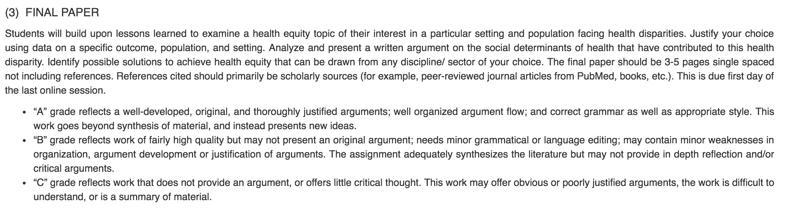
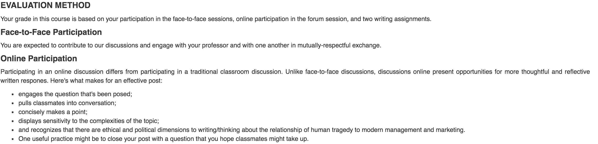

# Grading Guidance

### Evaluation Criteria 

This section of your syllabus includes a clear description of assessment types - participation, group work, paper, etc.–  and provides a breakdown of how you will calculate final grades. 

Use this section to: 

* Explain how assignments, activities, and projects will be assessed and the criteria you will use.
* Delineate how individual assignments contribute to the final grade.

### **Communicating Expectations**

**The following guidelines are recommended for graduate courses**:

* If more than 10-15% of the final grade is devoted to “class participation,” your syllabus should include some guidelines as to how you will assess “class participation.”
* If a large percentage of the final grade is devoted to a “course paper,” then your syllabus should indicate what interim assessments or feedback opportunities a student can expect on the paper during the term.

### **Grading & Program Requirements**

In order to prevent grade inflation, faculty are required to make sure the **average grade for their course does not exceed 3.32 \(B\)**.  At the beginning of the program, students are informed of these requirements.

Thus, we recommend that you use the program grading scale to set up your evaluation criteria and track student progress.

#### **REFERENCE: Grade Scale**

| Grade | GPA Scale | Defined As |
| :--- | :--- | :--- |
| A | 4 | _Honors_ |
| A- | 3.66 | _Superior Pass_ |
| B+ | 3.33 | _High Pass_ |
| B | 3 | _Pass_ |
| B- | 2.66 | _Low Pass_ |
| C+ | 2.33 | _Unsatisfactory_ |
| C | 2 | _Penalization for failure to complete coursework, prolonged class absence or academic behavior._ |
| F | 0 | _Penalization for academic misconduct or dishonesty. Failure to submit final exam or final deliverable._ |

### **Save Time– Use the Grade Center**

Making use Campus’ Grade Center will save you time. Unless the faculty and ID have implemented another tracking system, your Grade Center will be set up with:

* designated columns for each assessment. You may share scores and feedback. Columns are hidden to students before grading so instructors have to unhide them to show grades to students.
  * [How do I grade assignments in Grade Center?](http://www.screencast.com/t/sUfrlnG9qrM4)
* a hidden weighted grade column to track your students’ overall weighted percentage and letter grade.

### **The IE Brown Grading Sheet**

The grading sheet is an Excel spreadsheet with your student roster and a grade inflation calculator. The Program Management Team will send you grading sheets for each section \(M-1 and M-2\).

### **Grade as You Go**

Use the IE Brown grading sheet as a _calculator_ to check grade inflation before releasing grades. All columns are hidden from student view so you may enter grades and use the calculator to make adjustments.


TIP: Before you “unhide” assignment or participation grades, use the Grading Sheet _calculator_ to check the grade average \(3.32 or below\).


[**See detailed screenshots here**](https://brown-sps-online.gitbook.io/facultyguide/~/edit/drafts/-LSQMMkoS6xwI5d_10uI/ie-brown-emba-faculty/assessment-and-evaluation/sample-screenshots)**.**

1. Open Grade Center to assign student scores.
2. Get the letter grade from the weighted column in Grade Center.
3. Use your grading sheet “calculator”: type the letter grade in the Final Grade column.
4. If you have grade inflation, you may adjust your grade distribution or threshold to achieve the **3.32 average or below**.
5. Update your assignment score in Grade Center and then you may “show” scores to students.  


Where an average course grade is above the 3.32 \(B\) level you will be asked to provide formal justification in light of the criteria and procedures stated in your syllabus for program management to review.


### **Submit your Final Grades**

You will send your final IE Brown Grading Sheet to the program coordinator, program manager, and academic director two weeks from your final deliverable due date or session end date \(whichever is later\) **NOTE: You need to send a copy of your grading breakdown if you don’t use Grade Center.**  Once approved, program management will post final grades and notify students; faculty may provide detailed feedback to students directly. 

It is extremely important to submit your grading sheet with final course grades on time because the program management team reviews students’ academic performance at the end of each term of the program. Overall program grades are reported as a GPA and are calculated every academic term by weight averaging the grades across subjects \(based on session count\).

Students are informed about both their GPA and the position they hold in the class distribution in terms of percentile rank.

