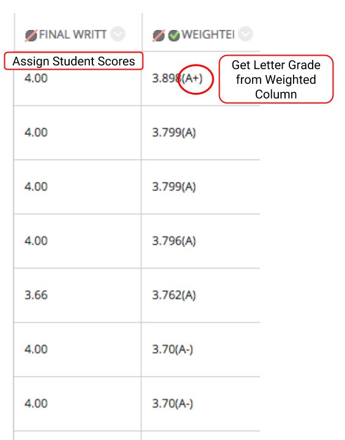
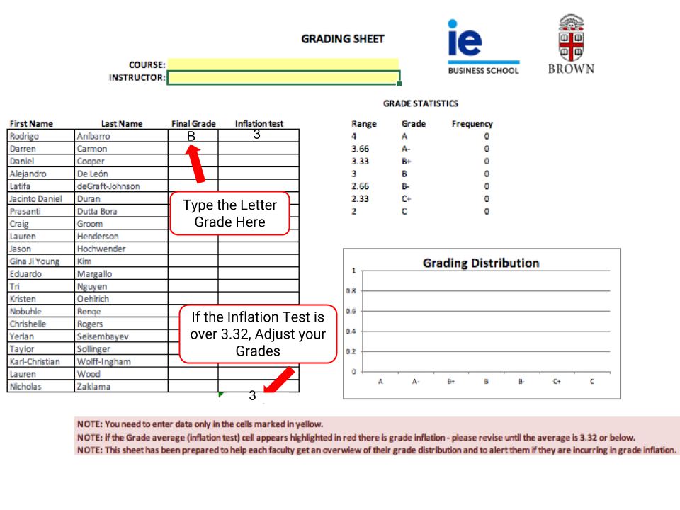

# Images - Grade as You Go

## Grade as You Go

Before you “unhide” assignment or participation grades, use the Grading Sheet “calculator” to check the grade average \(3.32 or below\).

1. Open the Grade Center to assign students' scores.
2. Calculate the letter grade based on the total score from Grade Center.

1. Use your grading sheet “calculator”: type the letter grade in the Final Grade column.
2. If you have grade inflation, you may adjust your grade distribution or threshold to achieve the 3.32 average or below.

