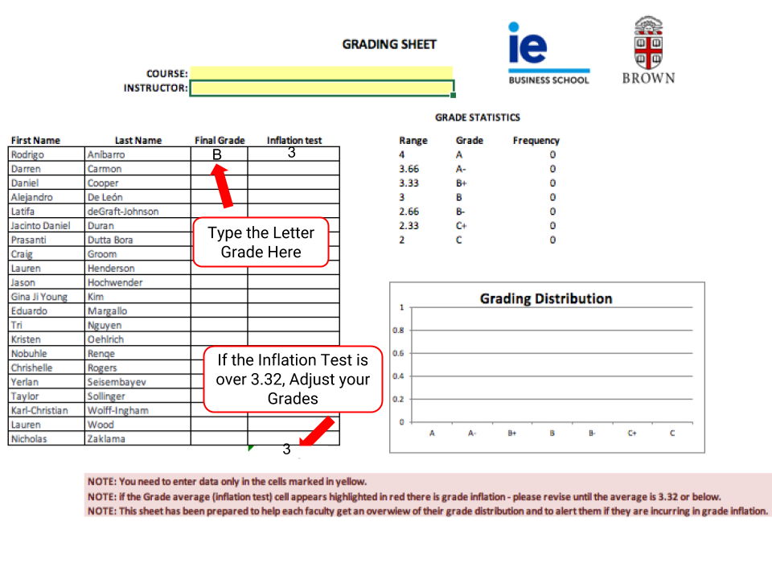

# Sample Screenshots

### Grade as You Go 

Before you “unhide” assignment or participation grades, use the Grading Sheet “calculator” to check the grade average \(3.32 or below\). 

* Open Grade Center to assign student scores. 
* Get the letter grade from the weighted column in Grade Center

*  Use your grading sheet “calculator”: type the letter grade in the Final Grade column. 
* If you have grade inflation, you may adjust your grade distribution or threshold to achieve the 3.32 average or below.

#### PDF of Screenshots



