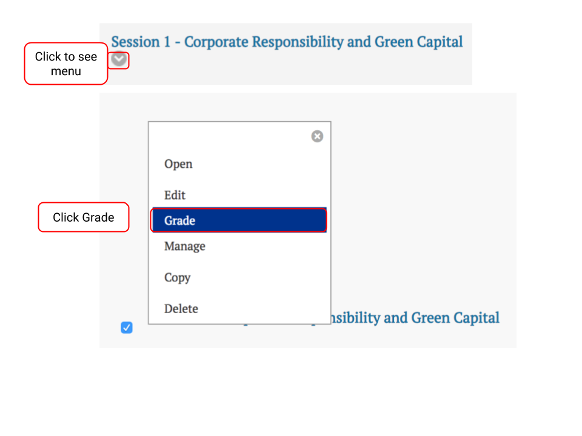

# How to Grade a Forum

1. From the Discussions area of your course, click the 'v' to see the drop-down menu. Click Grade to grade your discussion forum. 

2. Click the Grade button of the student you wish to grade. When you click on the Grade button you will be able to view and provide feedback on the posts the individual student made throughout the session's discussion.

3. Enter the grade and click Submit.


NOTE: You can provide feedback or general comments to students in the Feedback to Learner box. Make sure you click Submit if you’d like for students to see it.



To learn how to view how often students have posted in forum sessions and how to provide feedback, view this [helpful video](https://drive.google.com/file/d/0B6zg2iO3hP0ET05ob3ZVd19GYk0/view).


