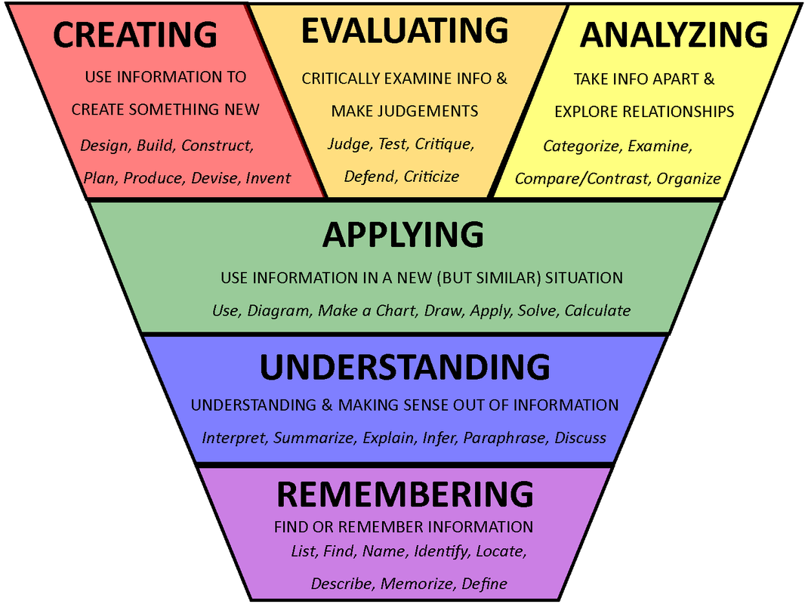

# Developing Learning Outcomes

### **Course-Level Student Learning Outcomes**

Course learning outcomes answer the question:   
__What will students be able to **do** as a result of this course? \*

Learning outcomes communicate expectations, structure learning, and guide instruction and assessment. Students benefit from courses that include a range of cognitive processes, from relatively simple tasks like remembering or understanding information to more complex thinking, such as critically analyzing information, completing a project, or creating new knowledge. Consider how you might incorporate activities involving a variety of [thinking skills](http://brown.edu/academics/professional/onlinelearning/img/ThinkSkills.pdf). The [Sheridan Center](https://www.brown.edu/sheridan/teaching-learning-resources/teaching-resources/course-design/establishing-learning-goals) also provides a guide for establishing learning goals.  
  
Course outcome statements should\*\*

* be student-centered rather than instructor- or content-centered,
* articulate what students should be able to do after completing the course,
* focus on the learning that results from the course rather than describing activities or lessons,
* be most critical to success in the course \(more detailed objectives can be developed for individual modules\),
* focus on overarching or general knowledge and/or skills,
* incorporate various ways for students to actively show success \(outlining, describing, modeling, depicting, etc.\) rather than using a single statement, such as “at the end of the course, students will understand \_\_\_\_\_\_\_ “.

#### **Examples**

Many faculty have found the following construct helpful:     
**Students should be able to... \(+ action\) \(+ resulting evidence\).**

_Students will be able to think critically and analytically by \(1\) evaluating observational and experimental data, \(2\) evaluating interpretation of data, and \(3\) empirically assessing hypotheses about animal behavior._

### **Module Learning Outcomes**

Module learning outcomes are stated at the beginning of each module/section and prepare students for what they will do in the module/section by expressing the result that should be achieved at the end. They are more specific than course outcomes and should include criteria for acceptable performance. For example,

* _You will be able to **conduct a study** to show how zoo animals use their exhibit using time point sampling._
* _You will be able to **design a marketing strategy** using social media for a new prescription drug for a specific population._

Outcomes focus on what successful learning produces for the student. Traditionally, however, teachers have tended to state objectives that express the process, what students will do as a learning activity. For example,

* _Analyze the alternative pricing strategies and the reasons for their use in multinational healthcare organizations._ 
* _Research your organization's' culture and its approach to implementation and change management._

Both are acceptable but the outcome statements may have more relevance and meaning for students because they address the purpose of the learning.

[Bloom’s Taxonomy of Educational Objectives](http://www.celt.iastate.edu/teaching-resources/effective-practice/revised-blooms-taxonomy/) provides examples of lower- and higher-order thinking involved in a variety of learning activities.

### **Essential Questions**

In addition to stating what students should be able to do after the module or course, you could also stimulate their thinking at the outset by asking open-ended questions, whose answers flow, in effect, from realizing the stated outcomes.

\*  Adapted from [Drexel University Institutional Research, Assessment, and Effectiveness](http://www.drexel.edu/provost/irae/assessment/outcomes/developing-course/)  
****\*\* Adapted from [Texas Tech University’s Office of Planning and Assessment](http://www.depts.ttu.edu/opa/resources/docs/writing_learning_outcomes_handbook3.pdf)

  

  

