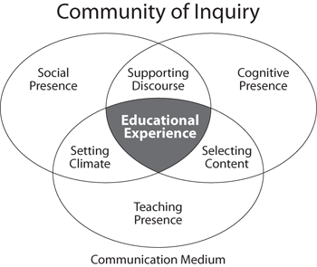

# Discussion Facilitation Strategies

Discussions are a key component of online courses. They help build community, encourage reflection, and develop critical thinking skills. In order to realize their potential, they must be intentionally and carefully designed, configured, and facilitated. Effective facilitation strategies support the objectives of a [community of inquiry](https://coi.athabascau.ca/): a collaborative learning experience where individuals “engage in purposeful critical discourse and reflection to construct personal meaning and confirm mutual understanding” through the application of three interdependent elements: social, cognitive, and teaching presence.  

How do you facilitate discussions in your seminars, with a light touch or something more? What influence do you exert? Do you let students maintain the momentum and intercede only to keep the discussion on track or do you participate more actively, leading the conversation and soliciting responses? Most online discussions lean toward the first model, since students are responding to a specific prompt and they’ve had time to compose thoughtful posts. This serves to keep discussions more focussed and less frequently in need of redirection.  

#### **The following strategies can be successful at producing the indicated effects.** 

**Carefully craft prompts.** While this is a part of design, not facilitation, open-ended, thought-provoking prompts that set expectations clearly for students will minimize the need for clarifying announcements or the chances students will take their responses in unintended and undesirable directions.  
****

**Observe the character of the discussion.** Does it meet your expectation for the activity? Many class discussions have a tendency to unfold in one of several identified styles, such as “The Eclectic Beaded Necklace,” in the words of one teacher: students post a response to the prompt without necessarily connecting it to preceding responses. You could think of this as a public assignment submission, like a paper, but visible to all in the class, not just the teacher. A more engaged style is “The Whirlpool,” where students circle around a subject, exploring it deeper and deeper. See this [Faculty Focus](https://www.facultyfocus.com/articles/teaching-and-learning/when-students-lead-the-discussion/) article—which isn’t specific to online—for more observed styles and how you can design for what you want.  

**Participate explicitly in the discussion.** Post your comments, advice, probing questions directly in the discussion so they are visible to all. This conveys your presence in this crucial aspect of the course. Guide the conversation as needed—such as by challenging students to probe deeper— without controlling it.

_How to participate_

1. Post a response to the prompt that clarifies, redirects, probes deeper, etc.
2. Reply to individual student posts to target specific replies \(thus creating a thread\).
3. Post a video response instead of text to differentiate it from others and personalize it even more.

_How much to participate_

1. Be careful not to write too much or too frequently as to appear to dominate the conversation. Yours is one among many voices here.
2. More than your face-to-face discussions, this is primarily a student-student forum. It presents opportunities for student-student interactions, so consider how your contribution to the discussion can encourage more student-student engagement.

**Provide feedback to individual posts.** Use Speedgrader to deliver assignment feedback and grading to individuals. It is addressed to and visible to only the intended student and can therefore be personalized. Consider how students add to the discussion and further the narrative rather than posting in parallel without a clear connection to what has come before.

**Summarize feedback.** Summarize your takeaways from the discussion through an announcement after the discussion closes or a page placed at the end of the module. Provide these for the benefit of all students, as opposed to individual and personalized feedback in Speedgrader.  


TIP: [See the Creating Discussions page](https://brown-sps-online.gitbook.io/facultyguide/working-in-canvas/discussions) in the Working in Canvas section to understand discussion mechanics and configuration options.


### References

Community of Inquiry \(n.d.\) _The Community of Inquiry Website_. Retrieved from [https://coi.athabascau.ca/](https://coi.athabascau.ca/)

Dyar, A. \(2016\). _Strategies for Facilitating Better Online Discussions_. SESP Instructional Technology Resources, Northwestern Univ. Retrieved from [https://edtech.sesp.northwestern.edu/2016/02/12/strategies-for-facilitating-better-online-discussions/](https://edtech.sesp.northwestern.edu/2016/02/12/strategies-for-facilitating-better-online-discussions/)

Owens, R. \(2009\). _Eight Tips for Facilitating Effective Online Discussion Forums_. Faculty Focus. Retrieved from [https://www.facultyfocus.com/articles/online-education/eight-tips-for-facilitating-effective-online-discussion-forums/](https://www.facultyfocus.com/articles/online-education/eight-tips-for-facilitating-effective-online-discussion-forums/)

Wayne, P. \(2019\). _When Students Lead the Discussion_. Faculty Focus. Retrieved from [https://www.facultyfocus.com/articles/teaching-and-learning/when-students-lead-the-discussion/](https://www.facultyfocus.com/articles/teaching-and-learning/when-students-lead-the-discussion/)

