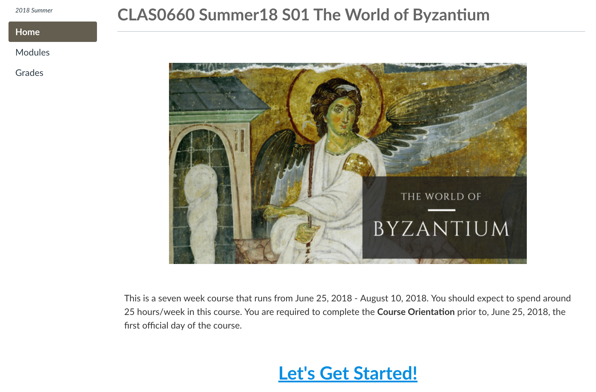
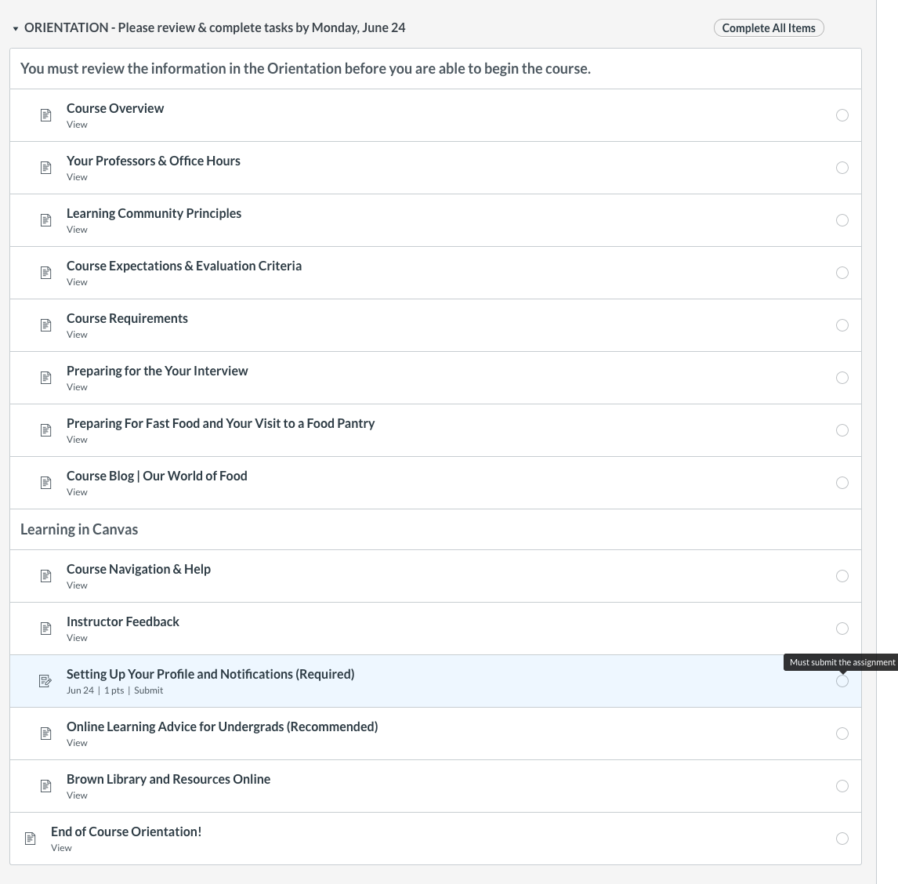
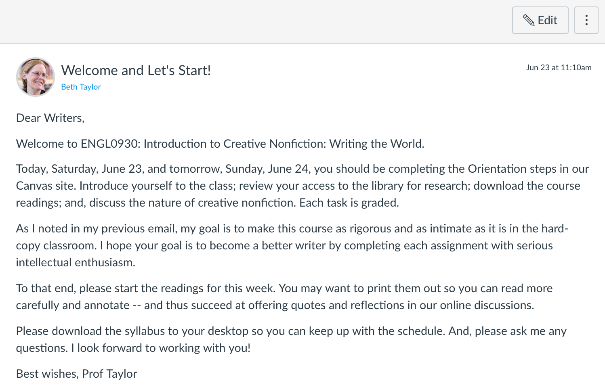
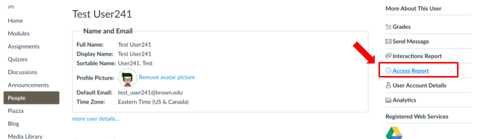

# Course Launch: The First Weeks

Once you’re finished designing, building, and testing your course, it is ready for launch. Course launch happens once the course is published and students are able to get started. It will be published– visible and accessible to your students– some time before the course start date.

Your students will log in eager to get started so it is important that your homepage tells the students what to do. In a face-to-face course, students walk into a classroom and sit down in an open seat. In an online course, they need to know where to go and what to do first.

**This course homepage tells students where they are and how to get started.**

### Orientation Module 

Courses are opened before the term start date so the students can get acquainted with the online course site. This period is called orientation and we have a designated orientation module. The orientation module includes information about the course– such as: the course description and objectives, expectations and policies, instructor information and office hours, course materials, technical requirements, and how to get help. In some cases, there are required assignments; e.g., set up Canvas notifications; upload a profile photo to Canvas; or, share time management strategies while taking this online course. Consider the orientation module to be a deconstructed syllabus– allowing students the opportunity to read it carefully and refer back to it at any time throughout the course.


NOTE: Students must complete the orientation module before they can access the other course modules. If they have trouble starting the course after orientation period, make sure they’ve completed the orientation and submitted all required assignments.


### Orientation Module for an Undergraduate Online Course

### **Welcome Announcement** 

To mark the official first day of the course, post a welcome announcement to let students know the course has begun. This first announcement let’s students know you are there.


TIP**:** Review our [Using Announcements](https://brown-sps-online.gitbook.io/facultyguide/teaching-online/using-announcements) and [Teaching Presence ](../teaching-presence.md)guides for more information about posting welcome announcements.


#### First announcement welcomes students and let’s them know what they should be doing.

### **Your Role in the** _**Getting to Know You: Student Introductions**_ **Discussion** 

The first online discussion is commonly used as a community building activity. Akin to an icebreaker, it’s an high engagement but low stakes online discussion– it is likely to be the first social activity of your course.

Make the discussion fun by crafting a good prompt that engages students. To ensure each student gets properly greeted by you, consider responding to each post. Your replies can be brief yet personalized.

#### Here are three _Getting to Know You_ discussion prompts from different courses



Please introduce yourself to our class sharing the following information: 

* Where do you come from? Where are you spending the summer? 
* What kinds of things do you do in your spare time?
* What are you studying and if you have already declared, what is your concentration?
* Consider the relationship between law and literature, and please describe your own experience with the law.
* What kinds of books or movies have shaped your understanding of law? \(Feel free to be specific and/or share links.\)



1. Please introduce yourself to the class. Discuss your background and your major.  Describe your interest in the field of psychology and specifically this course.  
2. Share what you are most interested in learning as well as what you are looking for from the instructor. 
3. Indicate your future career interests and aspirations, those within or outside of the field of psychology. 



Please introduce yourself to the class. Let us know what you have studied at Brown so far, and what made you interested in taking this course. If you know your concentration, tell us that too! It would be especially good to know if you have taken any courses that touch on Islamic Studies or Religious Studies, or if you haven't, what you hope to get out of the class.



### Managing Students During Shopping Period

The first couple weeks of a term usually means shifting enrollments. Keep an eye on the **People roster**, **Groups**, and/or **peer review assignments** so students do not get lost in the shuffle.


TIP: set reminders to check the People roster and Groups to make sure students are in balanced groups.


### Know Who’s There 

Use Canvas tools to track students’ progress and activity in your course. The first two weeks are just as important for you to get to know your students as they are for students to keep with the pace of the course. Given the freedom to manage their own schedule and due dates, it can be easy for students to fall behind.

You may refer to the **Gradebook** to see if students are keeping up with assignments. If a student is missing more than 2 assignments by the second week, be sure to reach out to them. Research shows that student motivation increases when their instructors demonstrate they care and are concerned about student's success.

**How to view an Access Report to get a summary of individual participation.** 

1. Open People. Then open User Details for an individual student.

2. Open Access Report.

3. The Access Report shows the content the student viewed, the number of times the student viewed the content, the number of times the student participated, and the last time the student viewed content.  

After the the first weeks are behind you, keep up the momentum and establish the ideal rhythm!

