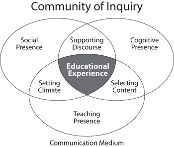

# Discussion Facilitation

### Community of Inquiry

Effective facilitation strategies support the objectives of a [community of inquiry](https://coi.athabascau.ca/): a collaborative learning experience where individuals “engage in purposeful critical discourse and reflection to construct personal meaning and confirm mutual understanding” through the application of three interdependent elements: social, cognitive, and teaching presence.  

How do you facilitate discussions in your seminars, with a light touch or something more? What influence do you exert? Do you let students maintain the momentum and intercede only to keep the discussion on track or do you participate more actively, leading the conversation and soliciting responses? Most online discussions lean toward the non-interventionist model, an acknowledgement that this is the students’ space and not the teacher-centered one characterizing many face-to-face classes. It might not be helpful to frame your understanding of the online discussion as the online version of the seminar. It’s not. It’s a different entity.   

Responses online are fewer, longer, more thoughtfully composed because students have time to carefully consider the prompt, research an answer, and cite sources if necessary, and they represent a greater diversity of voices because of their inclusivity‌.  

### **Facilitation Strategies**

**Carefully craft prompts and set requirements.** Strictly speaking, these recommendations are part of course design, not facilitation, but a poorly designed discussion may become a facilitation nightmare. See Discussion Design.

**Let the discussion unfold.** Does it meet your expectations for the activity? Many class discussions have a tendency to unfold in one of several identified styles, such as “The Eclectic Beaded Necklace,” in the words of one teacher: students post a response to the prompt without necessarily connecting it to preceding responses. You could think of this as a public assignment submission, like a paper, but visible to all in the class, not just the teacher. A more engaged style is “The Whirlpool,” where students circle around a subject, exploring it deeper and deeper. See this[ Faculty Focus](https://www.facultyfocus.com/articles/teaching-and-learning/when-students-lead-the-discussion/) article—which isn’t specific to online—for more observed styles and how you can design for what you want.

**Provide feedback to individual posts.** Use Speedgrader to deliver assignment feedback and grading to individuals. It is addressed to, and visible to, only the intended student and can therefore be personalized. Consider how students add to the discussion and further the narrative rather than posting in parallel without a clear connection to what has come before.

**Summarize feedback.** Summarize your takeaways from the discussion through an announcement after the discussion closes or a page placed at the end of the module. Provide these for the benefit of all students, as opposed to individual and personalized feedback in Speedgrader. Alternatively, assign a different team each week the task of summarizing discussion takeaways. 

**Participate explicitly in the discussion.** While it’s _uncommon_ for instructors to engage in online discussions directly, they might do so in specific circumstances to establish their presence, particularly in a get-to-know-each-other introductory discussion. More commonly, instructors summarize the discussion comments afterward \(see above\). Instructors, or TAs, might post in the discussion to keep student responses aligned with the scope of the prompt, provide clarifications, or perhaps connect ideas in different posts for further examination. Guiding through questions may be more effective at encouraging discussion than offering criticism, at least early in the discussion window, which may shut down some ideas.

Post your comments directly in the discussion. They will be visible to all \(unlike feedback in the grading area\). 

#### _How to participate_

1. Post a response to the _prompt_, which will appear parallel to other student responses. 
2. Reply to _individual student posts_ to target specific responses \(thus creating a thread\).
3. Post a video response instead of text to differentiate it from others and personalize it even more.

#### _‌How much to participate_**‌**

1. More than your face-to-face discussions, this is primarily a student forum. It presents opportunities for student-to-student interactions, so consider how your contribution to the discussion can encourage more student engagement rather than acknowledging the contributions of a select few.
2. Be careful not to write too much or too frequently as to appear to dominate the conversation. Yours is one among many voices here.


TIP: [See the Creating Discussions page](https://brown-sps-online.gitbook.io/facultyguide/working-in-canvas/discussions) in the Working in Canvas section to understand discussion mechanics and configuration options.


### References

Community of Inquiry \(n.d.\) The Community of Inquiry Website. Retrieved from [https://coi.athabascau.ca/](https://coi.athabascau.ca/)

Dyar, A. \(2016\). Strategies for Facilitating Better Online Discussions. SESP Instructional Technology Resources, Northwestern Univ. Retrieved from [https://edtech.sesp.northwestern.edu/2016/02/12/strategies-for-facilitating-better-online-discussions/](https://edtech.sesp.northwestern.edu/2016/02/12/strategies-for-facilitating-better-online-discussions/)

Owens, R. \(2009\). Eight Tips for Facilitating Effective Online Discussion Forums. _Faculty Focus_. Retrieved from [https://www.facultyfocus.com/articles/online-education/eight-tips-for-facilitating-effective-online-discussion-forums/](https://www.facultyfocus.com/articles/online-education/eight-tips-for-facilitating-effective-online-discussion-forums/)

Wayne, P. \(2019\). _When Students Lead the Discussion_. _Faculty Focus_. Retrieved from [https://www.facultyfocus.com/articles/teaching-and-learning/when-students-lead-the-discussion/](https://www.facultyfocus.com/articles/teaching-and-learning/when-students-lead-the-discussion/)

Simon, E. \(2018\). 10 Tips for Effective Online Discussions. _Educause_. Retrieved from [https://er.educause.edu/blogs/2018/11/10-tips-for-effective-online-discussions](https://er.educause.edu/blogs/2018/11/10-tips-for-effective-online-discussions)

Dunlap, J. \(n.d.\) Down-and-dirty Guidelines for Effective Discussions in Online Courses. Retrieved from [https://www.academia.edu/3014998/Down-and-dirty\_Guidelines\_for\_Effective\_Discussions\_in\_Online\_Courses](https://www.academia.edu/3014998/Down-and-dirty_Guidelines_for_Effective_Discussions_in_Online_Courses)  

