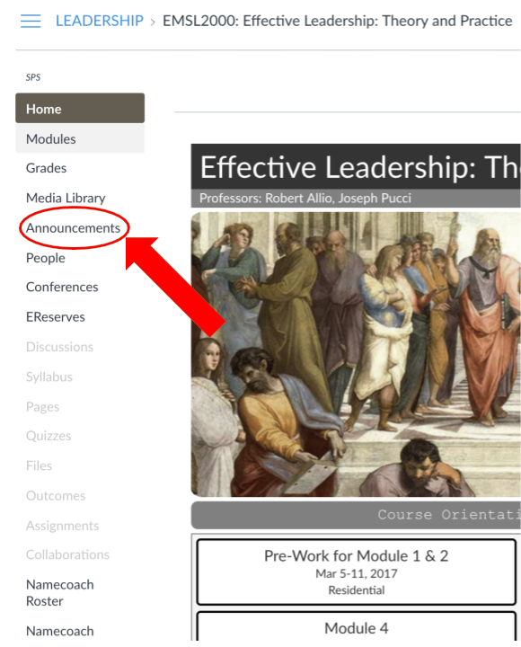
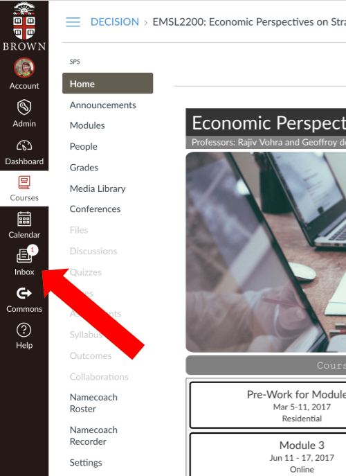

# Communicating with Students

Canvas has four ways faculty can communicate with students:

* Announcements 
* Inbox 
* Discussions 
* Grading/Feedback



#### Announcements

Announcements can serve various purposes. You should use them to post information that you feel all students should be immediately notified of. What this information is can be up to you, and you can use it to enhance your instructor presence.

Announcements can be used to:

* welcome students each week 
* provide wrap-up thoughts after an assignment or week 
* share important information about an assignment, current events or articles that are relevant to the course

You can access the announcements for a course by clicking the “Announcements” link in the left-hand navigation.

#### Announcement Options 

Announcements allow you to select various options for how and when you would like to post them.

Options like “Delay posting” are useful if you want to post an announcement at a particular time but are not able to do so -- just set it and forget it!  And if you want students to respond to your announcement, select “Allow users to comment.” **To post your announcement, select “Save.”**



#### Inbox

This in the internal message system within Canvas similar to an e-mail account. It allows to you quickly and efficient send someone or a group of people a message without having to search for their email address.

The Canvas Inbox has a built-in address book. The Inbox system works very similarly to gmail or another comparable e-mail service.




#### Discussions

This is another means of communicating with students. Discussions allow you to guide students, helping them to make connections between ideas and each other. They also give you a sense of how students are thinking about the topics in the course.

Engaging in discussions is an art. The goal is to encourage productive dialogue; you don’t want to dominate the discussions, but at the same time students will notice if there’s an absence of the course teaching team completely.


TIP: See [**What are Canvas Discussions**](https://brown-sps-online.gitbook.io/facultyguide/working-in-canvas/discussions)?




#### Grading/Feedback

The final means of communicating with students is through grading and feedback. Feedback especially helps students keep track of their progression through the course and gives a sense of how they are doing. Through the Gradebook, Canvas has many options for providing feedback:

* Overall assignment comment 
* Document markup so you can provide specific comments to sections/sentences/words \(this works very similarly to the Word markup tools\) 
* Audio or video feedback, with or without text comments



### 

