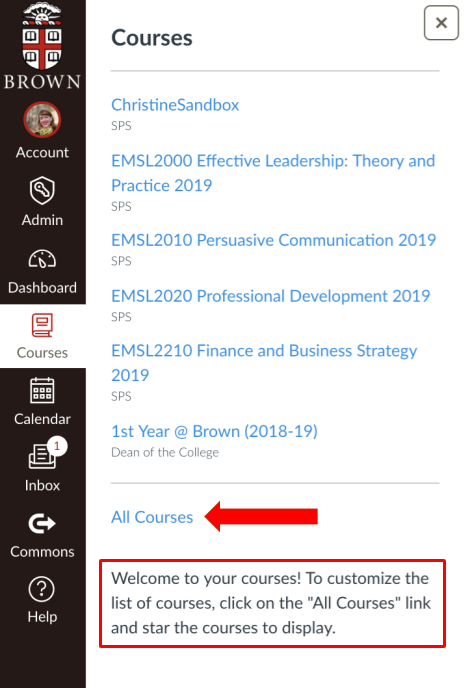

# Finding Your Course

When you first log into your course, you may not see your courses. To see them, click on “Dashboard” \(located on the left-hand sidebar\) and then, find and click the three vertical dots in the upper right-hand corner to select “Card View.”

### To Add or Remove a Course from the Dashboard

Let’s imagine you would like to see the courses “Christine’s Sandbox,” “EMSL2000: Effective Leadership,” and “EMSL2010: Persuasive Communication” on the Canvas dashboard. Right now, as you can see, that is not the case.

To make those courses to appear on the dashboard, you must select, on the left-hand menu, “Courses,” and then click on “All Courses.”

You will see a list of your courses, including past enrollments. Star the courses you want to appear on your dashboard.

You should now see the courses listed under “Courses,” and when you go back to your Dashboard, you will see them there as well. If you want more courses to appear, or make some disappear, just go back to “All Courses” and select, or deselect, the courses.

Here you will see all the starred courses now listed on the Dashboard.

To learn how to distinguish between terms, years, and cohorts within your course or program, please contact your instructional designer.

