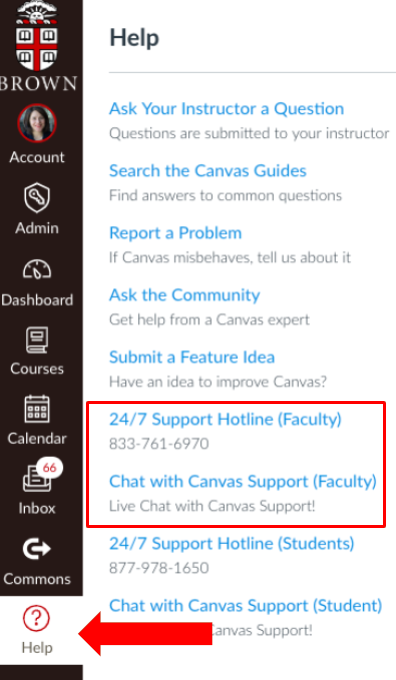

# Getting Help

### Get Help with Canvas

If you or a student has an issue with Canvas, the best way to get help is by clicking the **Help** icon in the Canvas left-hand menu.

Select the option to **contact Canvas directly by phone \(support hotline\)** or **live chat**. Both students and instructors have access to Canvas’ **24/7 support services**. If you know what problem you are trying to solve, you may [search the Canvas Instructor Guides](https://community.canvaslms.com/docs/DOC-10460), which are illustrated tutorials of common instructor how-tos about Canvas features.

  
 ****

### Get Technical Help \(Not-Canvas\)

If you have trouble with software \(e.g. Zoom, Google Apps, Brown Blogs, your computer, etc.\), contact the [Brown IT Help Desk](https://it.brown.edu/get-help).

### Get Help with Course-Related Items



For questions about Summer Session, the student roster, and/or students, email program staff at [pcsugcourses@brown.edu](mailto:pcsugcourses@brown.edu) or call 401-863-7901.

For questions about the **course design** or **facilitation** \(e.g., assignment & grading configuration, access, etc.\), email [dld@brown.edu](mailto:dld@brown.edu). Your question will be routed to the appropriate person on the Digital Learning and Design team.



For questions about an executive program, student issues, or scheduling, email the program manager at [executiveprograms@brown.edu](mailto:executiveprograms@brown.edu).  

For questions about the **course content** or **facilitation** \(e.g., course material, assignment & grading configuration, access, etc.\), email your dedicated Instructional Designer.  



