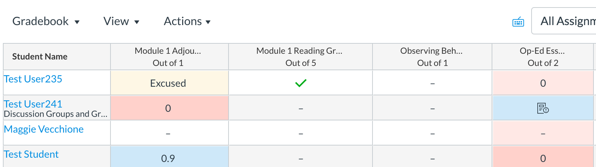
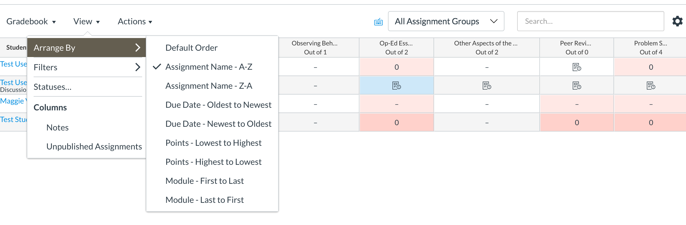
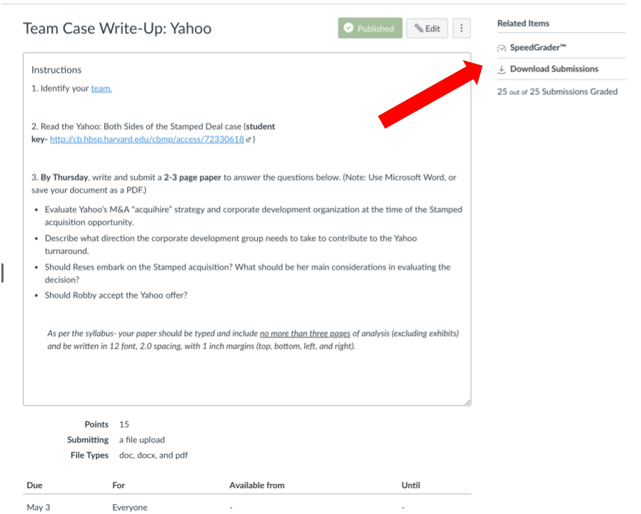
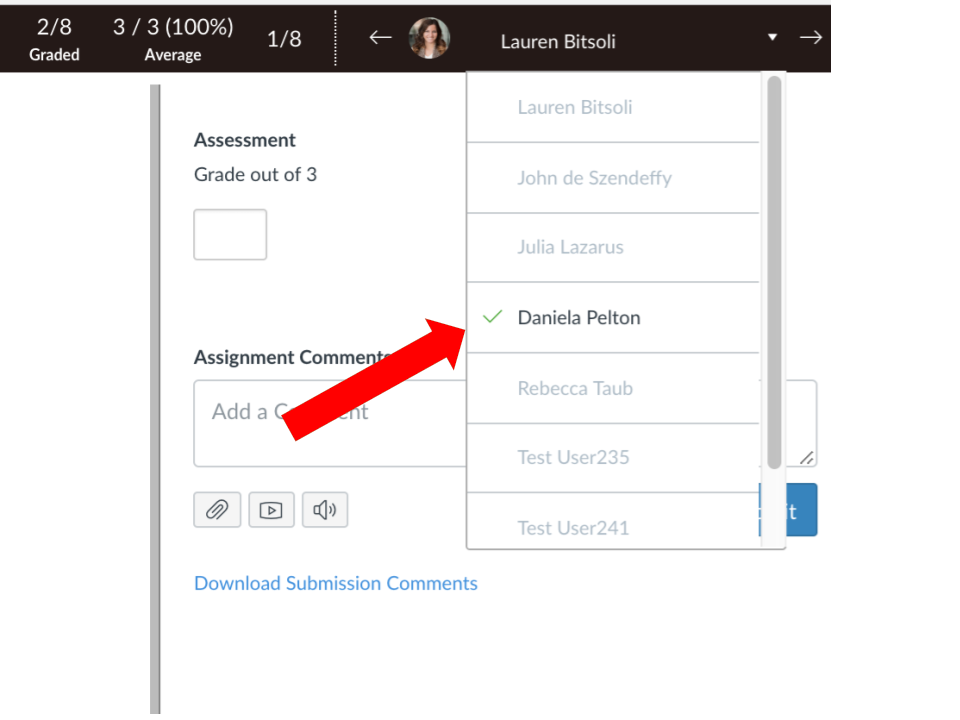

# Grading in Canvas

Grading is an important component of any course. But in an online course, it is one of the few ways you can provide essential feedback and guidance to students. Canvas offers more than one way of providing grades and feedback, and we cover them below.

### Finding and Viewing Student Work 

Canvas has three options for viewing grades and grading.

1. Quick grading on the Grades tab
2. “Assignments” view
3. SpeedGrader!



Your Canvas Gradebook will look like this:

You will see many colors and symbols. For information on what those colors and symbols mean, please see [How Do I Use the Icons and Colors in Gradebook?](https://community.canvaslms.com/docs/DOC-13020-415295583)

To change how information is arranged in the Gradebook, simply select **Arrange By** under the **View** menu to configure your view. 

  
You will be able to arrange columns by due date, points, assignment name, and modules.


TIP: Instructors find the "due date" most helpful. To arrange the grade book items by due date.


### Finding a Resubmission 

Please also keep in mind that you can find resubmissions in Speedgrader by selecting the most recent submission.

In SpeedGrader click the drop down under **Submission to view** to see and download the most recent submission:  




You can access SpeedGrader through an assignment.




Speedgrader offers a quick and friendly way for you to review the assignments and discussions each student has contributed.  It also lets you provide feedback to your students using text, audio or video, and even lets you write your feedback directly on the documents they’ve submitted.

#### Navigating Submissions in Speedgrader

1. Pulldown lets you see all students, and which ones have submitted work.

2. The view of an assignment might be little different depending on whether you’re looking at a discussion, a file or a text submission  

3. Set the grade posting policy at a course level or on an assignment to hide or post grades. Setting these policies in advance of grading will allow you to complete your grading without students being able to see grades until you post them.  For more information on how to post and hide grades, please see the Hide and Post Grades knowledgebase article: [Hide and Post Grades in Canvas](https://ithelp.brown.edu/kb/articles/hide-and-post-grades-in-canvas).

For more information on SpeedGrader in general, please see [How Do I Use SpeedGrader?](https://community.canvaslms.com/docs/DOC-12774-415255021)



