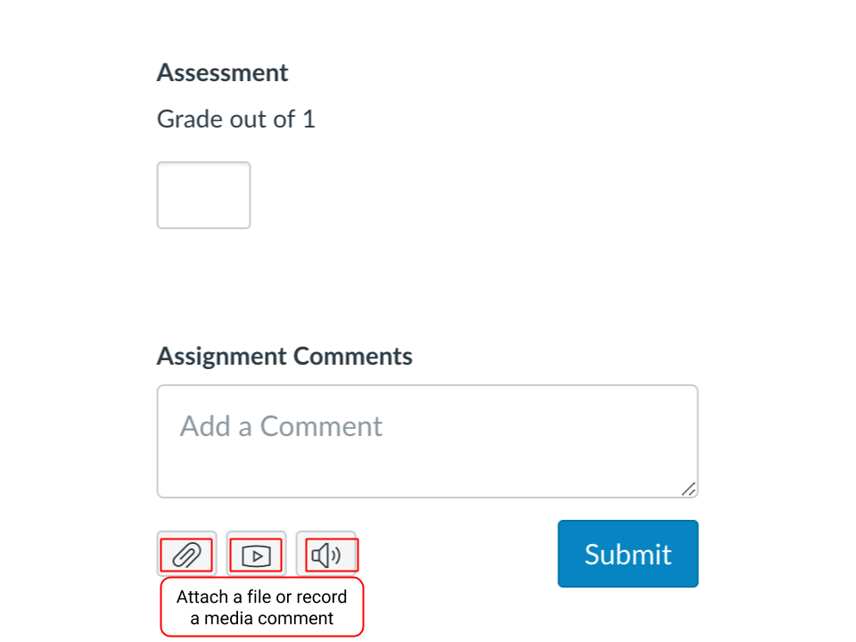
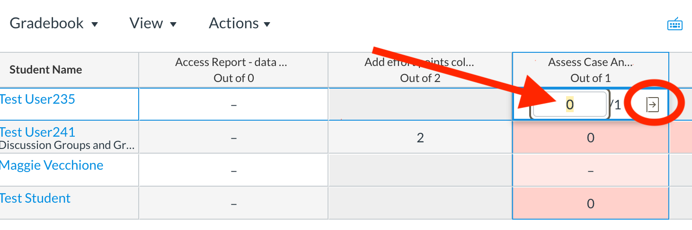
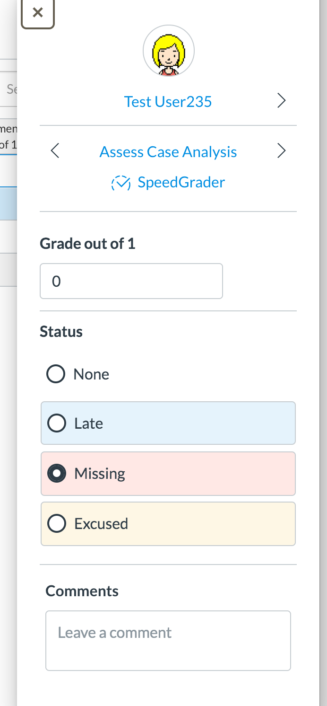

# Giving Students Feedback

Giving feedback to students can be done in three ways.

1. Feedback from assignment comments 
2. Filling in a grade through the gradebook 
3. Annotating a document directly 



To provide feedback through assignment comments, simply put your comments in the assignment comments field in SpeedGrader.

This is located on the right-hand side of the screen. Once you have done so, or posted your grades, a notification will be sent to the student. Students can respond to your comments as well. Please note you can also offer media comments or upload a file.


TIP: Most instructors primarily provide feedback to students using this “Assignment Comments” method.





You can enter a grade in percentage or points in the cell or click the grade detail tray icon to set a status for the assignment, provide comments, and enter the grade. Simply click on the cell and select the arrow icon to open the grade detail tray. 




Another feature in Canvas allows you to comment directly in the assignment as it appears SpeedGrader. Please note that no notifications will be sent to students. You may want to add a line such as ‘see my annotations’ in assignment comments comment form as well.




