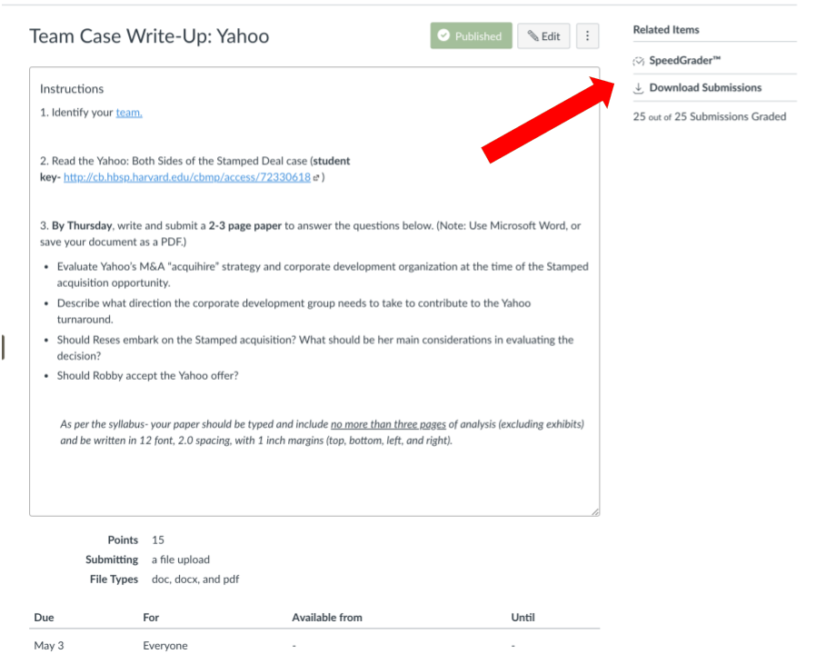

# Reviewing Student Work and Grading

### Finding and Viewing Student Work 

In this sheet, we will address Canvas’ three options for viewing grades and grading.

1. Quick grading on the Grades tab
2. “Assignments” view
3. SpeedGrader!



Your Canvas gradebook will look like this:

You will see many colors and symbols. For information on what those colors and symbols mean, please see [How Do I Use the Icons and Colors in Gradebook?](https://community.canvaslms.com/docs/DOC-13020-415295583)

To change how information is arranged in the gradebook, simply click on the gear in the right-hand corner.

  
You will be able to hide student names, arrange columns by due date, points, assignment groups, and other categories.


TIP: Instructors find the "due date" most helpful. To arrange the grade book items by due date, click the “Arrange columns by due date” option.


### Finding a Resubmission 

Please also keep in mind that you can find resubmissions \(which appear shaded in yellow in the gradebook\) by selecting the most recent submission \(unless you or the student has specified some other submission\).  
  
****This is how it appears directly from the Gradebook:  
  
****

And this is how it appears in SpeedGrader:  




You can access SpeedGrader through an assignment.




Speedgrader offers a quick and friendly way for you to review the assignments and discussions each student has contributed.  It also lets you provide feedback to your students using text, audio or video, and even lets you write your feedback directly on the documents they’ve submitted.

#### Navigating Submissions in Speedgrader

1. Pulldown lets you see all students, and which ones have submitted work.

2. The view of an assignment might be little different depending on whether you’re looking at a discussion, a document or a text submission  

3. Muting assignments will allow you to complete your grading without students being able to see them until you’re done.  Unmute to share them with all students simultaneously. For more information on how to mute and unmute assignments, please see the Canvas Guide: [How Do I Mute or Unmute an Assignment in the Gradebook?](https://community.canvaslms.com/docs/DOC-12961-4152724339)  and [How Do I Mute or Unmute an Assignment in SpeedGrader?](https://community.canvaslms.com/docs/DOC-12965-4152724338)

For more information on SpeedGrader in general, please see [How Do I Use SpeedGrader?](https://community.canvaslms.com/docs/DOC-12774-415255021)



