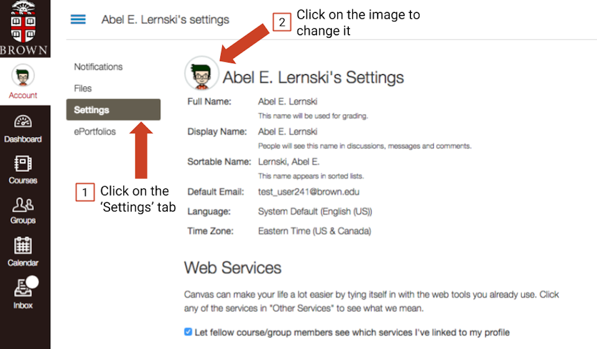
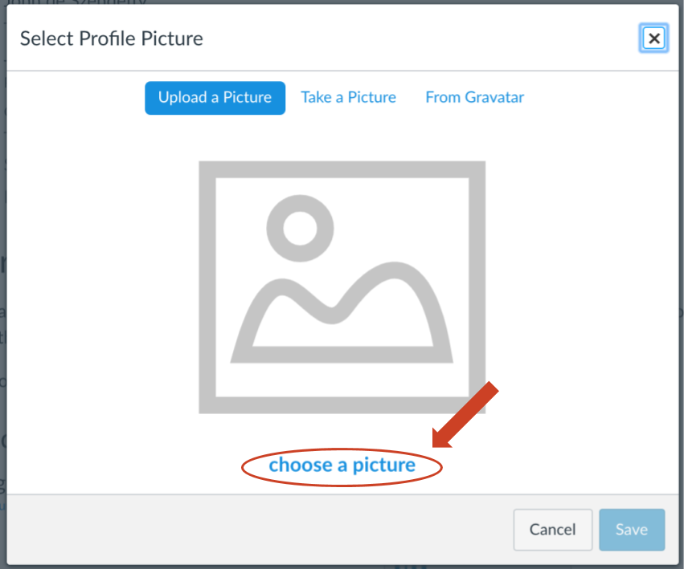
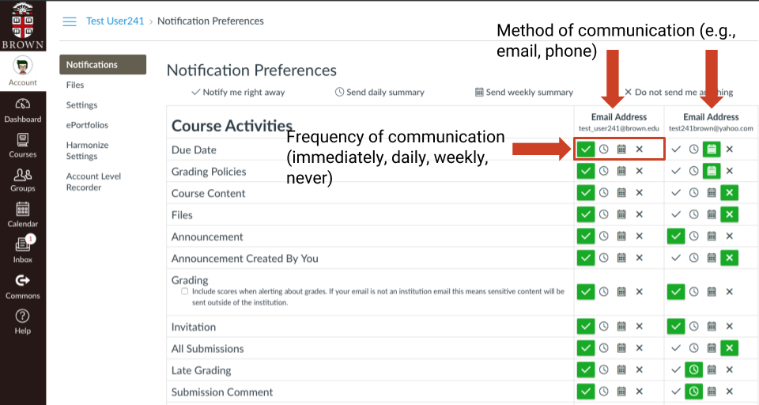

# Setting Up Your Profiles and Notifications

### What is a Canvas profile? 

Your Canvas profile includes your name, image, contact information, time zone, and language. Your profile image is important because students and teachers want to know they are communicating with a person in Canvas, not just text. It humanizes the interface, personalizes your posts and submissions, and makes clear to students with whom they are communicating.  
  
By default, your Brown email address is your primary contact method in Canvas, but you can add other email and a phone number for text messages. By default, the time zone for your Canvas account is ET. If you are living/working outside the ET time zone, you might want to change this. You cannot change your name in Canvas, however, without changing it with the University \(in Banner\).

#### Updating your profile

1. Click on **Account** in the left-hand sidebar. **** 
2. From the **Settings** sub-menu click on your image/placeholder to change.  

    3. Upload a picture for your profile or take one with your webcam. Use one that reflects who you actually are \(not a logo or avatar\).  
  
****

### 

### What are Canvas notifications? 

Tell Canvas how often you want to be notified of specific course activity. You also begin with one method of communication, usually your Brown email address. You can add your mobile phone number to get text messages.  

#### Changing your Notifications

1. Go to the **Accounts** tab again and choose the **Notifications** sub-menu to view or change your notification triggers.  [See this Canvas Guide for specific instructions on changing the default frequency of notifications.](https://guides.instructure.com/m/4152/l/719738-how-do-i-set-my-canvas-notification-preferences-as-an-instructor) 
2. Go to the **Settings** sub-menu to add other contact methods. 

   [See this Canvas Guide for specific instructions on adding other contact methods.](https://guides.instructure.com/m/4152/l/719736-how-do-i-add-contact-methods-to-receive-canvas-notifications-as-an-instructor)

###  

