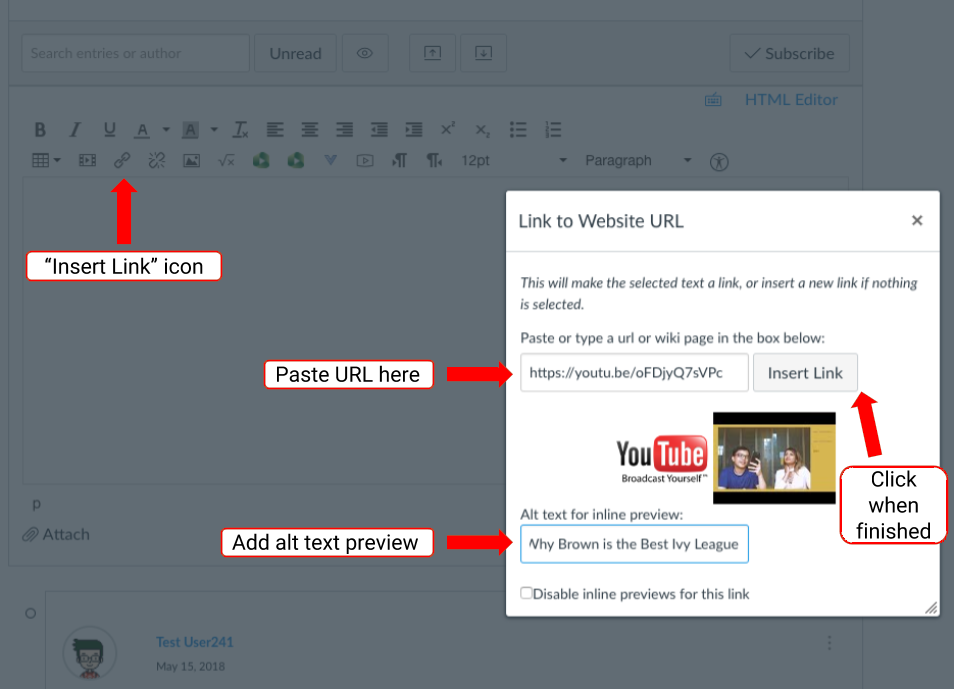
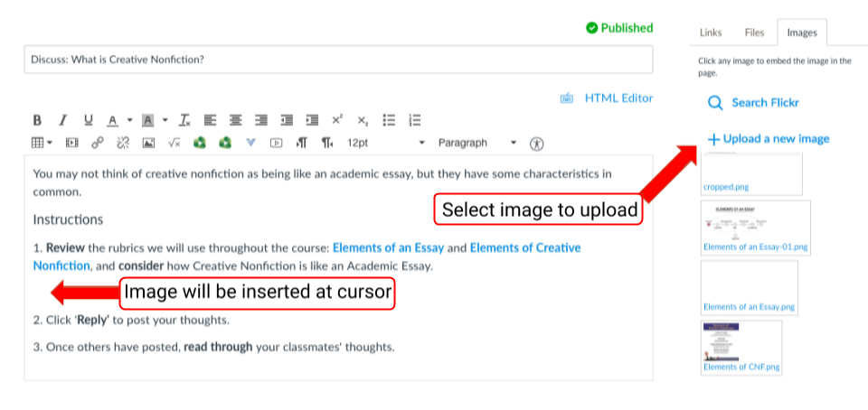
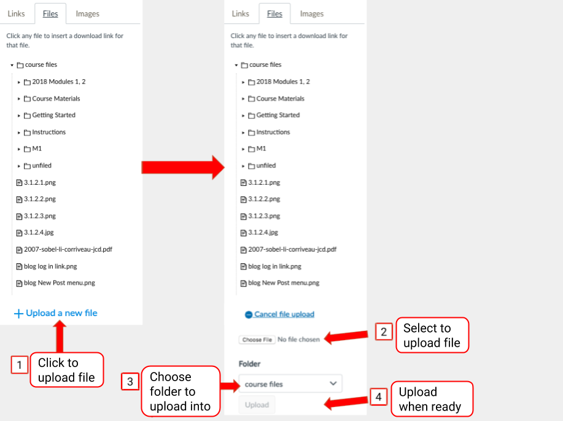

# Adding Files to Your Online Content

You can share a number of file types, including .pdf, .xls, .doc, .png, .jpg, .mov, and URLs in your content. 

We've highlighted 3 common practices for sharing files or web pages.

1. Add a Video URL
2. Link a File \(xls, pdf, doc, ppt, etc.\)
3. Embed an Image \(png, jpg, etc.\)


NOTE: Use the same process for linking to websites and uploading or sharing images, videos, or text files for all Canvas page types \(e.g. discussions, pages, assignments or announcements\). 

🚩 To add files to online content, you must be actively editing the Canvas page. 




### Adding a YouTube Link \(URL\) to a Discussion Reply

1. Copy the **Share YouTube** link. \(You will need it for step 3\)
2. From the discussion, click **Reply.** This will open the discussion reply editor.
3. Click the **Insert Link** icon and paste the YouTube link you copied in the box provided.
4. Add an **Alt text for inline preview** to make this video link accessible to all students.
5. Click **Insert Link** to embed this video in your reply post.
6. Contextualize the video link so students know why you are sharing it and what to do with it.
7. Click **Post Reply** to add this to the discussion.

To share a URL, you’d follow the same process.   
Click the link icon and paste the URL in the space provided.




### Link to a File in an Announcement 

1. After navigating to **Announcements** on the left-hand side of your course site, click **+ Announcement** to draft your message. 
   * The announcement message should specifically mention the file you are sharing so students know what it is. \(e.g.; "_Please review the excel spreadsheet with the correct formulas to check your work._"\). __
2. Highlight the **text to link**, and then select the **Files** tab and click on your excel file. 

3. Click **Save** on your announcement to post in the course.


TIP: You may also add a file as an attachment to an announcement but it is less visible to the viewer because it appears below the announcement text.




### Embed an Image in an Assignment

1. Download the image file to your computer. 
2. Edit the assignment page and place your cursor where you’d like to insert the image file.

3. Select the **Images** tab on the right to find and select the image file. Once you click the image, it will appear in the assignment content editor.

* Resize the image if it is too big or too small. 
  * Click on the image to highlight it and then select the embed image icon from the rich content editor; the Insert/Edit Image box will pop up. Under Attributes, edit the dimensions to resize the image.
* Add Alt text to make the image accessible for learners using assistive technology. 
  * Under Attributes, edit the Alt text. Alt text is a succinct description that is equivalent to the function of the image. Do not use phrases like “image of” or “graphic of” to describe the image.

4. Click **Save** on the assignment page.



### Need to add a file to Canvas? 

If you have not uploaded the file to your Canvas course yet, you need to click **+ Upload a new file** to one of your folders in the Files area. To learn more, visit: [Uploading Files to Canvas](../using-your-course-files.md).

