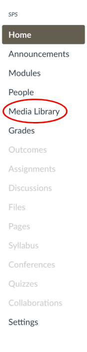
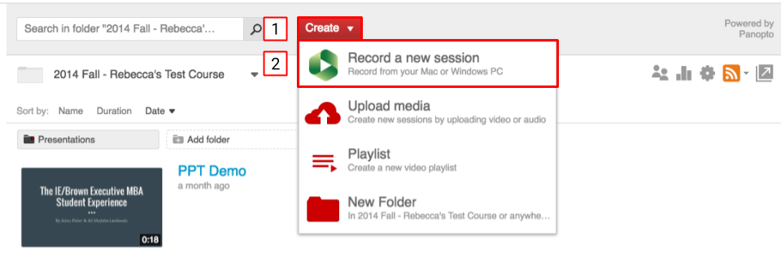
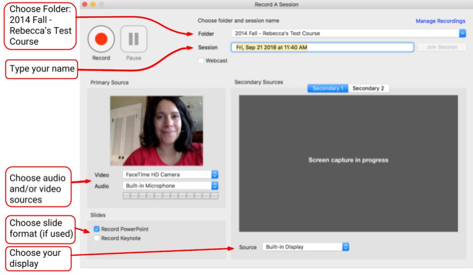

# Record a Screencast

A **screencast** is a digital recording of what a person does on their computer—the video version of a screenshot or picture of something on your computer's screen—which may also contain audio narration to accompany the video. 

**Panopto** is the media server at Brown. The steps below show you how to record a screencast with  Panopto, and upload it directly to your course's media library. 

### Recording a Screencast 

1. Click on **Media Library** from the left-hand course navigation.

2. Choose **Record a new session** from the **Create** menu.


NOTE: If you have Panopto installed on your computer, the Panopto media recorder should open up. If you do not, you will be prompted to install the correct version for your operating system \(OS\) using your Brown credentials. After installing, open Panopto.



3. The Panopto media recorder window is simple. Make a few selections and you're ready to record your presentation.

* Prepare your microphone. Use a headset or earbud mic instead of the computer's built-in mic, if possible.
* Select your Secondary Source 1 and you can start recording!
* To finish recording the presentation, press the Esc key on your keyboard, and then click on the Stop button.

4. Rename the screencast with an appropriate title by editing the text in the **Session name** box. Select **Upload** to upload the file to Canvas. The upload request takes a few minutes to process.

Once processing is complete, you may close the Panopto recorder. Your screencast file will automatically be uploaded to your course's media library. You can edit your screencast \(e.g. cut portions\). [Be sure to visit Brown's IT Knowledgebase for information about editing screencasts.](https://ithelp.brown.edu/kb/articles/basic-editing-in-panopto)

