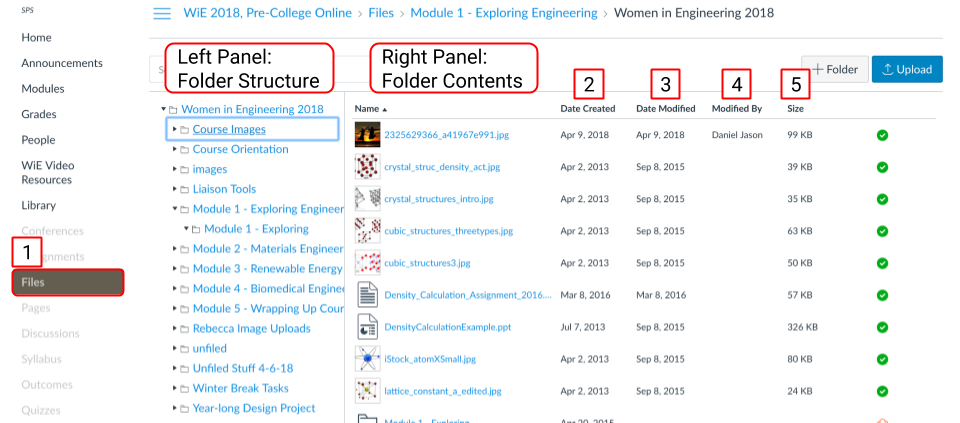

# Uploading Files to Canvas

As an instructor, **Files** allows you to store files within Canvas. When your course gets copied year over year, your uploaded files will move with your course. This is especially important for image files!

You can upload one or multiple files, view details about your files, preview files, publish and unpublish files, and restrict access to files. 


TIP: Come up with an organized file structure so you can find and archive your files in this area otherwise it can become unwieldy!


```text
Disorganized Files and Folders
```


```text
Organized Folders and Files
```




From the Files view \(1\), the Left Panel shows all folders in Files. Click the folders to display the contents on the Right Panel. The right panel displays the contents of the selected folder. The right panel will show the the name of the file, the date the file was created \(2\), the date the file was modified \(3\) and the name of the person who modified the file \(4\) \(if modified by another user\), and the size of the file \(5\).

You can download, rename, move, and delete files. Check out the [**Canvas guides to learn about managing your files**](https://community.canvaslms.com/docs/DOC-12771-415241391).


**Files** is fully searchable. You can create folders \(and folders within folders\) and upload files.


  


